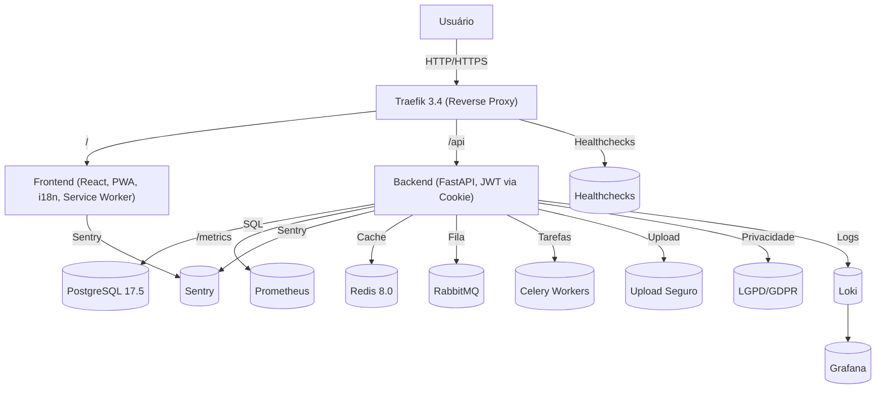

# Arquitetura do Sistema

## Serviços e recursos
- Reverse proxy (Traefik 3.4) para HTTPS, roteamento e segurança
- Healthchecks para todos os serviços
- Volumes persistentes para uploads e banco
- Monitoramento centralizado (Grafana/Loki, Prometheus, Sentry)
- Deploy blue/green, backup automatizado, auditoria de dependências
- Autenticação moderna via cookies httpOnly
- Frontend PWA, internacionalização, acessibilidade, testes automatizados
- Pronto para reuso como template 