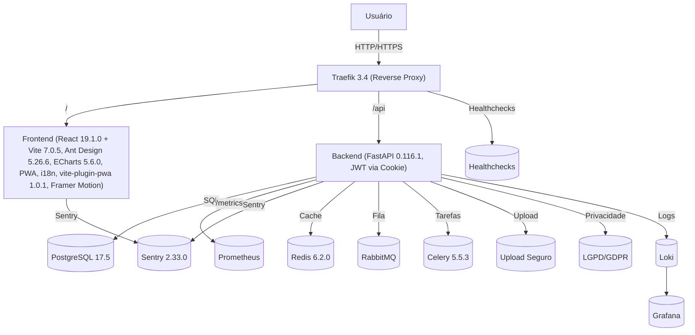

# Arquitetura do Sistema

## Serviços e recursos
- Dashboard com múltiplos gráficos ECharts, filtros dinâmicos e animações Framer Motion
- Reverse proxy (Traefik 3.4) para HTTPS, roteamento e segurança
- Healthchecks para todos os serviços
- Volumes persistentes para uploads e banco
- Monitoramento centralizado (Grafana/Loki, Prometheus, Sentry 2.33.0)
- Deploy blue/green, backup automatizado, auditoria de dependências
- Autenticação moderna via cookies httpOnly (FastAPI 0.116.1, python-jose 3.5.0)
- Frontend React 19.1.0 + Vite 7.0.5, Ant Design 5.26.6, ECharts 5.6.0, PWA via vite-plugin-pwa 1.0.1, internacionalização, acessibilidade, testes automatizados (Vitest 3.2.4)
- Pronto para reuso como template

## Principais versões
- React: 19.1.0
- Vite: 7.0.5
- Ant Design: 5.26.6
- ECharts: 5.6.0
- vite-plugin-pwa: 1.0.1
- FastAPI: 0.116.1
- Celery: 5.5.3
- Redis: 6.2.0
- RabbitMQ: (ver docker-compose)
- Sentry: 2.33.0
- Prometheus: (ver docker-compose)
- Loki: (ver docker-compose)
- Grafana: (ver docker-compose)
- Alembic: 1.16.4
- SQLAlchemy: 2.0.41
- pydantic: 2.11.7 