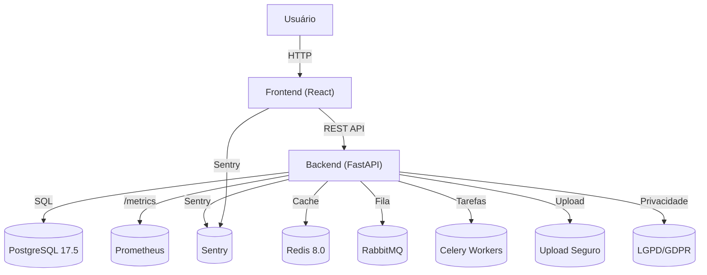

# Arquitetura do Sistema

## Serviços
- **Redis 8.0:** cache e backend do Celery
- **RabbitMQ:** filas para tarefas assíncronas
- **Celery:** processamento assíncrono
- **Alembic:** versionamento de banco
- **Upload seguro:** rotas protegidas para arquivos
- **LGPD/GDPR:** políticas e endpoints de privacidade
- **docker-compose 3.9:** orquestração de todos os serviços 